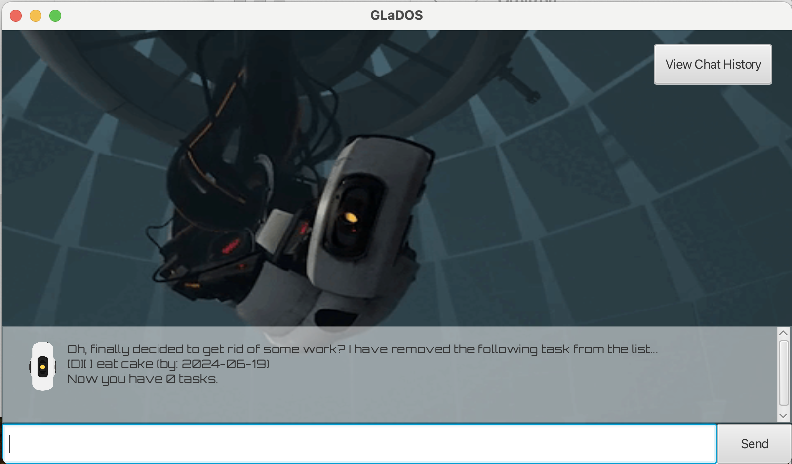

# GLaDOS Chatbot User Guide

GLaDOS is a versatile chatbot for managing tasks, based off of the video game character in _Portal_. If you can type fast, GLaDOS can assist with your task management quickly and efficiently (albeit a little reluctantly).

## Quick Start

1. Ensure you have Java 17 or above installed on your computer.
2. Download the latest `.jar` file from the [releases page](https://github.com/jayjay19630/ip/releases).
3. Copy the file to the folder you want to use as the home folder for your chatbot.
4. Open a command terminal, navigate to the folder you placed the jar file in, and run the following command:
   `java -jar GLaDOS.jar`
   A GUI similar to the one below should appear in a few seconds.
5. Type a command in the command box and press Enter to execute it.
6. Refer to the [Features](#features) below for details of each command

Type a command in the command box and press Enter to execute it.

## Features

Note: Words in UPPER_CASE are parameters to be supplied by the user.

Items in square brackets are optional.
Items with …​ after them can be used multiple times.
Parameters can be in any order.
Extraneous parameters for commands that do not take in parameters will be ignored.
Viewing Help: help
Shows a message explaining how to access the help page.

Format: help

Adding a Task: add
Adds a task to the task list.

Format: add TASK_DESCRIPTION INDEX

TASK_DESCRIPTION: The description of the task.
INDEX: The number of tasks after addition.
Examples:

add Finish report 3
add Call mom 1
Deleting a Task: delete
Deletes a task from the task list.

Format: delete INDEX

INDEX: The index of the task to delete. Must be a positive integer (e.g., 1, 2, 3, …​).
Example:

delete 2
Listing All Tasks: list
Displays a list of all tasks in the task list.

Format: list

Marking a Task as Done: mark
Marks a task as completed.

Format: mark TASK_DESCRIPTION

TASK_DESCRIPTION: The description of the task to mark as done.
Example:

mark Finish report
Unmarking a Task: unmark
Marks a task as not completed.

Format: unmark TASK_DESCRIPTION

TASK_DESCRIPTION: The description of the task to unmark.
Example:

unmark Finish report
Updating a Task: update
Updates the description of an existing task.

Format: update NEW_TASK_DESCRIPTION

NEW_TASK_DESCRIPTION: The updated description of the task.
Example:

update Finish the final report
Printing an Error: printError
Displays an error message caught by GLaDOS.

Format: printError EXCEPTION

EXCEPTION: The error to be printed.
Exiting the Program: exit
Exits the program.

Format: exit

Command Summary
Action Format, Examples
Add add TASK_DESCRIPTION INDEX
e.g., add Finish report 3
Delete delete INDEX
e.g., delete 2
List list
Mark mark TASK_DESCRIPTION
e.g., mark Finish report
Unmark unmark TASK_DESCRIPTION
e.g., unmark Finish report
Update update NEW_TASK_DESCRIPTION
e.g., update Finish the final report
Print Error printError EXCEPTION
Exit exit
FAQ
Q: How do I transfer my data to another computer?
A: Install the app on the other computer and copy the data file from the previous GLaDOS home folder to the new one.

Known Issues
UI Glitches: If you encounter any UI glitches when using multiple screens, try restarting the application.
Help Window Minimization: If the help window is minimized and you run the help command again, it might not reappear. To resolve this, manually restore the minimized help window.
